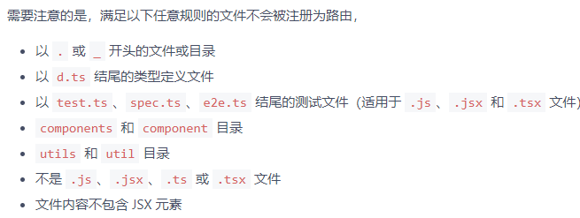

# umi-plugin-convention-routes

[](https://npmjs.org/package/umi-plugin-convention-routes)
[](https://npmjs.org/package/umi-plugin-convention-routes)

这是一个为`约定式路由`功能而做的插件，适用于`umijs@3.x`

它会代替`umijs`原有的`约定式路由`逻辑。

## 更新记录

### 0.1.x

- feat: 增加动态路由功能（参考[umijs的动态路由](https://umijs.org/docs/convention-routing#%E5%8A%A8%E6%80%81%E8%B7%AF%E7%94%B1)
- fix: 修复 umi@3.2.6+ 版本使用插件后无法启动的问题

## Why

`umijs`本身带有约定式路由的功能，为什么我要重新做一个？这就要从我的路由编写习惯说起了。

### 以前的路由书写习惯

在`umijs2.x`及之前，除了特殊的目录和文件，约定式路由会扫描所有的`js`，`ts`文件作为页面。并使用该文件的`目录路径`+`文件名`作为路由名称，其中如果是`index`文件，则省略`文件名`。

这种路由规则，其实是最接近传统多页应用的。但是这也带来一个麻烦的问题，就是页面文件比较杂乱（因为页面可能还会带一个样式文件），不方便在`pages`下添加其它内容/子模块（因为默认会被识别为页面)。

所以我们约定了，只能识别`index`作为页面入口，以约束路由规则。在这种模式下，一个目录中只会包含一个页面文件及样式文件，所有和该页面相关的子模块/组件，也能够存放在该目录的`components`目录下，相关的`model`，`services`也是同理。如果是本页的特殊配置（比如复杂列表的表头），也可以在目录下单开一个文件存放。以目录的方式将页面按功能分隔开来，在后续维护升级的时候也更加方便。

所以，我们约定了以下规则，以进一步约束`约定式路由`。

1. 不再识别所有`js`文件，只能识别`index`文件作为页面入口。 -- 解决不便于添加额外内容的问题（比如复杂列表，其表头的描述就可以单独提取一个文件存放）
2. `index`文件不编写任何业务内容，只引用真实的页面文件并`export`。 -- 解决编辑器文件定位问题，编辑`/home`页面，还是查找`home.jsx`文件（不然全是`index`，定位起来很难受吧）
3. 所有本页面相关的子模块/组件，model，业务接口，都存放在当前页面目录的`components`, `models`, `services`子目录中。 -- 给所有资源都添加作用域的概念，避免所有资源都定义在全局，等项目迭代多了，有用的没用的都在`src/components`目录里。

所以对于一个页面`/home`，至少会存在以下文件：

```
/pages/home/index.js  -- 页面入口
/pages/home/Home.jsx  -- 页面本体
/pages/home/Home.less  -- 页面样式
```

本页面的资源，可以这样定义：

```
/pages/home/components/XXX -- 首页专用的组件/模块
/pages/home/models/home.js -- 首页的dva-model
/pages/home/columns.js -- 可能是当前页面的表格头部定义
```

### umijs@3的路由做了哪些改变

<p></p>

我们可以[查看文档](https://umijs.org/docs/convention-routing)发现，umijs默认对路由增加了一些限制。

上面提到的`文件内容不包含 JSX 元素`不作为路由解析的规则，与我将`index`作为页面入口的规则相互冲突。因此我编写了这个插件，代替`umijs`以行使我的路由识别规则。

### 注意事项

如果你也赞同我上面的约定式路由规则，欢迎尝试本插件。否则请使用`umijs`的默认规则。

## Install

```bash
# npm or yarn
$ npm install umi-plugin-convention-routes -D
```

## Usage

Configure in `.umirc.js`,

```js
export default {
  plugins: [
    // 注意：umijs@3会扫描符合命名规则的插件并自动注册，所以这里不需要额外注册插件（注意看报错信息）
    // ['umi-plugin-convention-routes'],
  ],
}
```

## Options

Configure in `.umirc.js`,

```js
export default {
  /* 都是可选项，不配置就是我的默认规则 */
  conventionRoutesConfig:{
    /* 页面根目录 */
    pageRoot: 'src/pages',
    /* 可识别的文件(glob通配符) */
    files: ['index.js', 'index.ts', '_layout.js', '_layout.ts', '_layout.jsx', '_layout.tsx'],
    /* 排除的内容(glob通配符) */
    ignore: ["**/components/**", "**/layouts/**", "**/models/**", "**/services/**"],
    /* 对扫描到的文件进一步过滤 */
    filter: path => false,
    /* 不建议修改，对每一个扫描到的节点进行格式化，用于生成路由配置 */
    formatter: () => ({})
  }
}
```

## LICENSE

MIT
